We decompiled COD4.


## Scenario
This blog post serves a lore-dump for *SwagSoftware*'s latest release: [KisakCOD](https://github.com/SwagSoftware/KisakCOD).


## SwagSoftware's Motivations, and what is "Kisak"?
KisakCOD is the 3rd game project for *SwagSoftware*

The first project being [Kisak-Strike](https://github.com/SwagSoftware/Kisak-Strike), and the second being the sleeper hit [kisak-thug](https://github.com/SwagSoftware/kisak-thug).

The goal with *Kisak-Strike* was just to have a nice moddable CSGO that enthusiasts could poke around and have fun with. A 100% Open Source project that could be ported to any platform and preserved forever on the internet.
It was a cool project, and I'd say it fulfilled those goals - we even had someone port it to the obscure [e2k](https://en.wikipedia.org/wiki/Elbrus_2000) architecture(that is literally impossible for you and me to acquire).

With Kisak-thug, the goal was to take the [THUG source](https://github.com/thug1src/thug) and port it to Win32. (It was only for XBox/PS2/GC)

Kisak-Strike and kisak-thug both used partial leaked source codes for their respective games with extra modifications to make things more operable in the modern era while still being respectful of the original material.
Is it ethically-right to just put copyrighted source code on GitHub? Well Valve is pretty friendly towards modders, and they seem to have given it a pass. THUG was already on GitHub for over 10 years prior and I just forked it. *(KisakCOD isn't related here)*

***Kisak*** is our mythical iconography of Open Source. A mysterious being who claims all software to be GPL. He demands of his most chaste followers that they run a Gentoo system with all programs forcibly self-compiled. We have taken a practical pilgrimage to Windows, but we do not wholly betray his teachings. 

```
"New hardware comes, Paradigms change, but Software lives forever." -- Kisak (2045)
```

## COD 4 is Different from other CODs
KisakCOD is the 1st De-Compilation of a game I've done. It's one that I've wanted to do for probably 10 years now(It's one of my favorites, I spent countless hours on XBox playing it).

COD4 was released back in a time when games came with modding tools and dedicated server builds.

Mods were built-into the game as an explicit feature. [The GSC Scripts in COD4 were shipped raw with comments](https://github.com/volkv/CoD4-Default-GSC-Scripts) and developer-specific profiles.

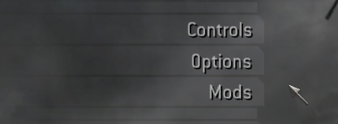

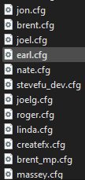

```
Star Wars Galactic Warfare: a formerly popular mod that turned COD4 into Star Wars
```

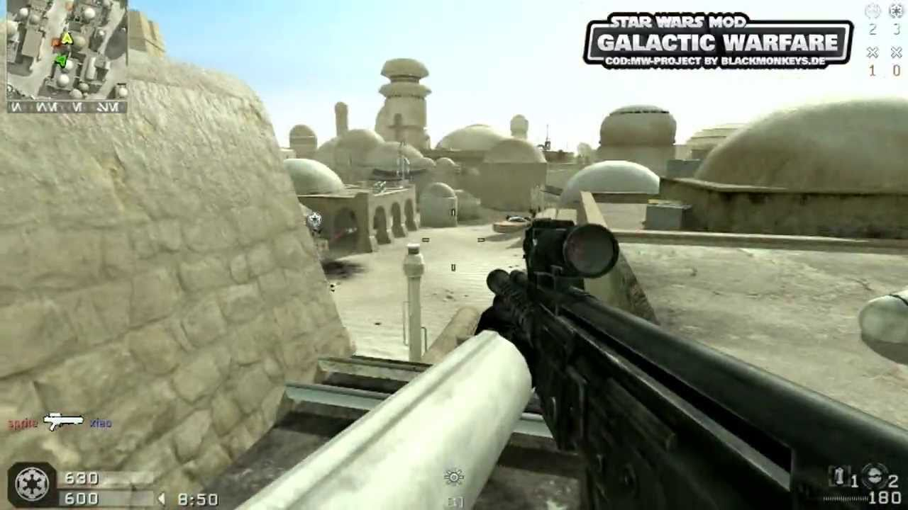

There are still people making COD4 mods today that are amazing

```
COD4 Rooftops: A modern COD4 campaign made by enthusiasts
```

[https://www.youtube.com/watch?v=row5eYSdvMA&t=780s](https://www.youtube.com/watch?v=row5eYSdvMA&t=780s)

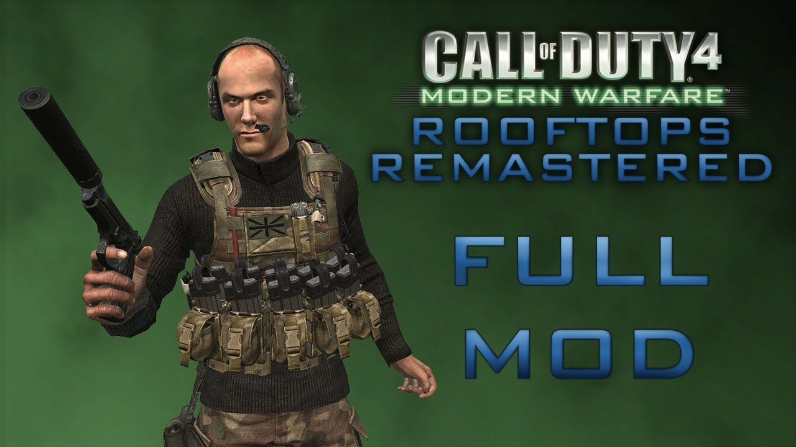


However, my favorite would have to be COD4 ProMod. I even used to host a random low-pop server for it 10+ years ago.

ProMod is basically vanilla COD4 with some tweaks to the gameplay. It's fast, hardcore, and can be extremely hard for newcomers (I'm not particularly good).

It's probably the most amount of fun you can have in a multiplayer FPS.

The real highlight is the smoothness of the IW3 engine, it runs at a locked rock-solid 125/250/333 FPS.

The different FPS caps each have a distinct effect on the physics of the world. 333 is probably the most overpowered one due to how high you can jump, and 250 is used more often.

The COD4 maps shine when combined with the fast gameplay of ProMod, and due to the way they were modeled, they offer tons of unique jumps, bounces, and spots you can get into.

Given how good COD4 ProMod is, just Imagine the possibilities with an Open Source COD4. 

```
Hot Take: IW3 is better than Source Engine(At least CSGO). I think that the CSGO developers would even agree on this.
```

## The Golden Age of Game Dev (You Missed It!!)

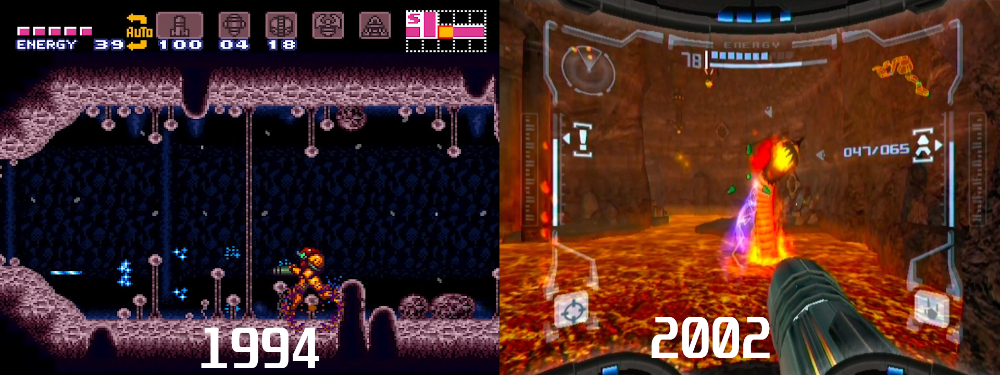
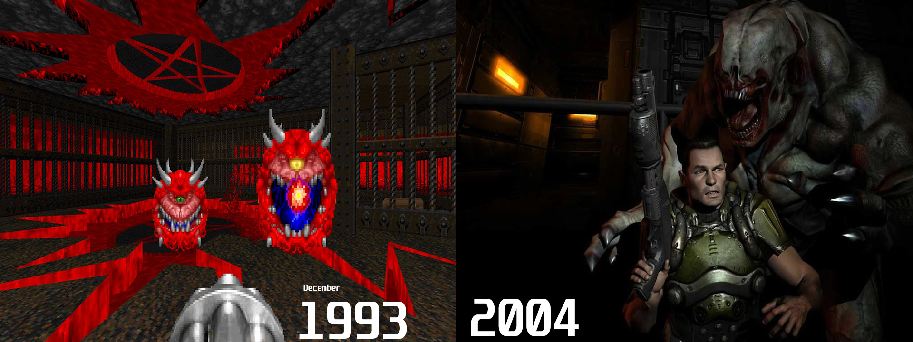

In 10 years or less Video Games went from 16-bit sprites to fully 3D scenes with realtime lighting and skeletal+vertex animation.

In the middle of this "Golden Age", Quake 1 Released in 1996. In 1999, the Source Code was made public. If you didn't want GPL, licensing was available from id software for about 125,000$.

It was possible for just about anyone to learn these new 3D technologies and become a trailblazer for the industry. Modding and mapping was extremely popular and if you were good you could easily get a job ad id software, Raven, or another similar company.

If you were around back then, you got in at the ground-floor and everything got more complex over time at a natural rate. If you followed game development back then, you got to witness the natural evolution of things like they were Dota2 patchnotes.  

And despite what some might think, game developers back then were tigers. 

Coders were extremely sharp, they instinctively knew when to use advanced data structures (like all manner of self-balancing BSTs). Bit logic, ascii, x86 opcodes, and cache lines were just natural to them. They didn't have Google or Stackoverflow, they had to contact an expert if they wanted help.

Artists came from a background of actually having to draw on pen and paper. They had to spend money on those consumable resources in order to train their skill. They were trained by even more skilled classical artists.

Writers wrote books that were designed to be a "AAA" experience on paper. The plots for early video games were thought-provoking and interesting. (Ghost Recon 1 almost predicts the current Ukraine conflict)   

***Nowadays... Things are different...***

Most of the legendary Game Studios let their sensei's retire without passing on their knowledge.
Many of these studios live on in name-only. (not naming any, and I'm not hinting at IW here, the mobygames credits tracking for COD4 is still pretty solid)

Custom engines are extremely rare and require a huge bankroll.

Models, textures, animation, and more is outsourced to 3rd world contractors (See Starfield credits). AI is being integrated right now to further degrade the artisanship.

FPS optimization is an afterthought.

Coders are "managed" by non-technical business majors who put them into a box. They are assigned tasks from a sprint instead of being self-driven and just doing what makes obvious sense.

(There's more points I could make, but you get the Idea)

***Most game dev sucks now, but it wasn't always bad.*** 

Luckily we can still respectfully revisit old games like COD4, and enjoy them to this day... And by deep-diving into the game engine we can somewhat [mimic this golden age and live it for ourselves](https://www.youtube.com/watch?v=j1D7k_qqJts).

# KisakCOD: The Making Of

Alrighty, let's go into the technical details of how this Decompilation came about.


#### Pre-Planning - A Plethora of Information

There are dozens of Debugging Information (.PDB) publicly available for COD games.

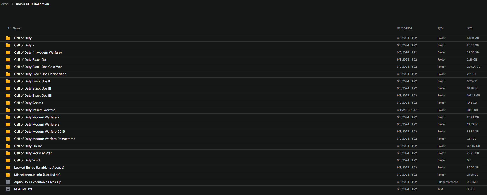

For Call of Duty 4 alone there are 

- At least 2 Win32 PDB's (v1.0 and v1.1)
- 6 Xbox 360 PDB/MAP's (Including one for the Retail v1.0)
- Macintosh Version with ELF symbols

Later on, we also started to use the Black Ops 1 and Black Ops 2 Win32 PDB's just to double-check some things.

Keep in mind that COD4 is based on COD2, which is based on COD, which is based on idtech3, so I used [Jedi Academy](https://github.com/grayj/Jedi-Academy) as a reference for a good amount of the framework.(This game was actually GPL'd by Raven/Activision in the early 2000s).

I had the idea of this project in the back of my mind for a long time, but it wasn't until someone gave me one the v1.0 PC PDB, that I decided to pull the trigger. 
Previously, the XBox version was just a bit too much work to pursue(PowerPC Arch), and the v1.1 PDB was too hard to find.

This build contained asserts, and had local variables named too, so it was a no-brainer. 

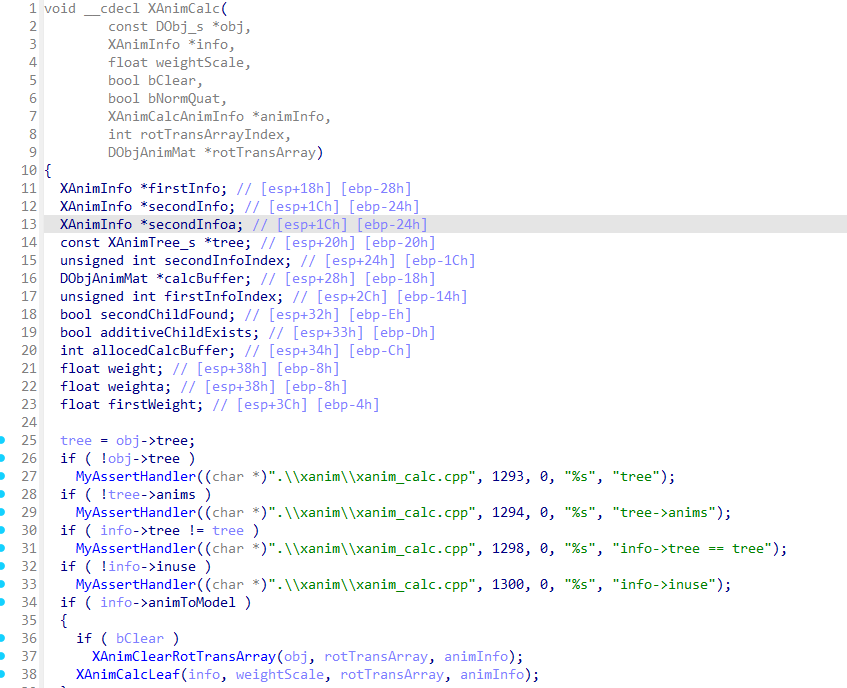

```
Blops1 and Blops2 builds have this as well, I'm surprised that nobody has done a decompilation of those games yet.
```

I got a couple excellent programming associates of mine to join in at this point. We started around March 4th 2025.
- Avail
- *"Destructive Interface"*

#### Stage 0 - Figuring out the Process (Day 1-7)

I wasn't foolish enough to try and take the Jedi Academy source code and modify it, so we started from nothing. (You can see this step-by-step via the daily commits.)

First thing, I decided to try and flush out the file structure using the relative paths that are exposed in the asserts.

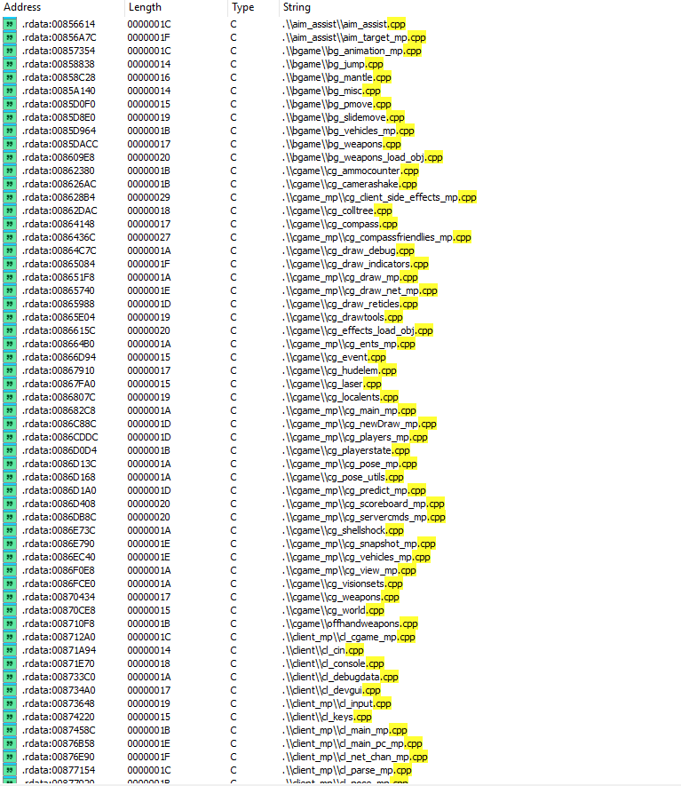

These were just empty files at this point, and it wasn't a complete listing. Lots of .cpp files don't have asserts, and .h files usually don't have them at all.

After a couple days of doing some R&D, I realized that the XBox copy(I used Retail v1.0) had a .Map file that specified which function was in which .cpp file.

The XBox version is quite similar to the PC version, so it was very usable in most places. `gfx_d3d/` did suffer a little bit, but not too bad.

```
This is what the .map file looks like. Each .obj corresponds to a .cpp file with the same name.
```
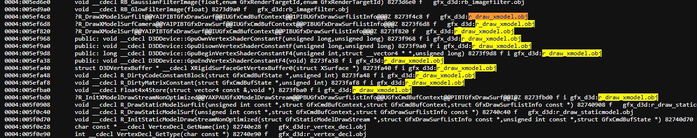

I did some manual decompiling to get an Idea of what it was like, but on Day7 I created an IDAPython script to help decompile batches of functions.

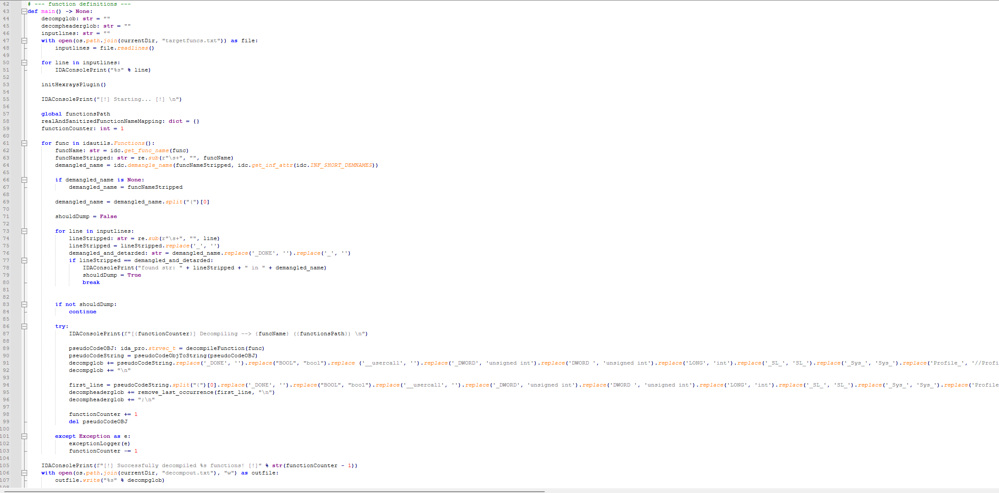

### Stage 1 - Filling out the functions (Day 7-32~)

So the process looked like this:

1) Find a .cpp file that you want to fill out (You could also find missing ones via the .map file)
2) (NotePad++) Find all for file.obj

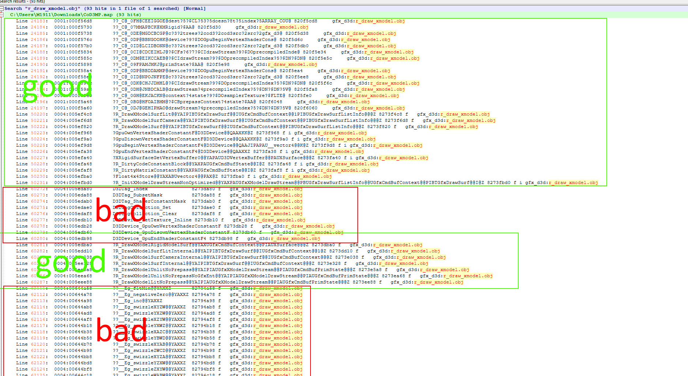

Manually remove any weird-looking functions or ones that don't belong there (D3D, Swizzle, etc).

Copy all this text into a new blank file

3) Demangle the text and use a regex (`!\b[a-zA-Z_][a-zA-Z0-9_]*\s*\(`) to extract just the function name. Put these in `targetfuncs.txt`

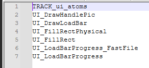

4) Run the IDAPython script (It automatically looks for targetfuncs.txt) and it will dump 2 files.
   `decompout.txt` and `decompheaderglob.txt`.

5) Paste the contents of `decompout.txt` into your .cpp file. Paste `decompheaderglob.txt` into a corresponding .h file or into a shared .h file(depends).

6) You've now found all the functions for that .cpp file, however they will need manual fixing, types, and global variables added later. Also you might find some missing ones that you'll need to add later. Have fun!

If you're wondering why this process wasn't automated more, it's basically because of how many unique edge cases there could be. The script was already making things way easier and doing quite a bit of automated work. I'd say the biggest headache here was the in-ability to update IDA's decompilation database. If you changed the typing of a global variable you'd have to press F5 2x in the function to update it. There was no way we could find to do it automatically or with Ctrl-F5.

### Stage 2 - Fixing the Filled out functions (Day 32-55~)

After the files were all filled out, you could then conveniently go down the list from A-Z and fix all Intellisense errors.

The project was just a simple .sln with files dragged in, it was very convenient and worked well enough.

After the file was completed, you could test compilation by right clicking the [.](https://youtu.be/qWTAC0zO_-U)cpp file and clicking "Compile"

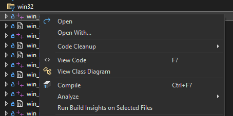

<video width="900" height="600" controls muted>
  <source src="../videos/compilin.mp4" type="video/mp4">
  Your browser does not support the video tag.
</video>

We ran into many IDA problems (Casting being disabled from accidental pressing of '\', decomp not updating even with ctrl-F5, Wrong function prototypes despite having a PDB, etc...). 

It required a lot of manual fixup work.

This was also the period of time when we found things that needed to be customized.

#### ODE Physics

COD4 Uses the [Open Dynamics Engine](https://github.com/thomasmarsh/ODE) for Physics.

I placed tag 0.5.0 or so from 2004~ in there, and it matched fairly well. 

However, there were a great deal of changes in this library. The original developers were not afraid to jump into libraries and start optimizing the code for their purposes.

"*destructive_interface*" took charge here and matched it fairly well with the decompilation. It would require even more work later while debugging...

#### Bink and Miles
COD4 uses Bink (for Cutscenes) and Miles Sound System(Entire Audio Stack).

These are both proprietary libraries made by RAD Game Tools.

I emailed RAD to ask for version of these libraries:


But it seems that they were too busy to respond, so no luck from them.

Bink SDK was easy to find, but Miles was less common. It needed to be approximately the right version, otherwise all the code would have to be re-written and it probably would not be the same result.

After hours of searching, the best result was here: [https://github.com/rocketprogrammer/disney-miles](https://github.com/rocketprogrammer/disney-miles)

This was basically a perfect match, but later we got linker errors. I suspect the .lib file is different from the .h slightly.

After more searching... I was able to find the full installer for Miles 7.2e which was released in October 2008. This required some small rewrites in the audio code, but was mostly OK.

The EQ filter - [Dogecore](https://github.com/HappyDOGE) had to patch `milesEq.flt` to get this to work. This seems custom for COD4; it has 3 band values per filter pass.


### Stage 3 - Debugging and Cleanup (Day 55-NOW)

This part took the longest and is still on-going.

From here, the daily commits stopped, and it turned into just fixing things on a sporadic basis.

##### Black Screen and Database Errors. Bink Disabled.

So starting up, we had a black screen that was due to some Pixel Shader variables not having default values (whoops).

Bink was disabled since this is the MP binary anyway, the cinematics were just pure green, but the sound worked.

The database is a real nightmare. AKA the "fastfiles". As far as I can tell, they're called "fastfiles" because they literally just get slurped up into memory and then the pointers(Set to -1 or -2 on disk) are fixed on load. This also makes them architecture-specific.

There were several instances of things not being deref'd properly here...

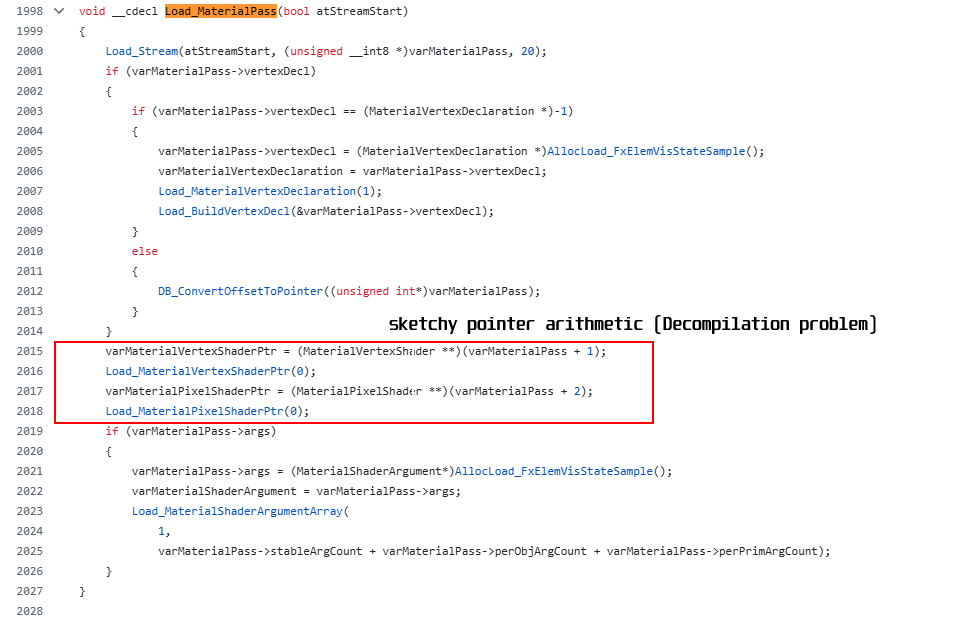

Afterwards, the game could load into the main menu, but *many* things were broken.

<video width="750" height="600" controls muted>
  <source src="../videos/cod4kootise.mp4" type="video/mp4">
  Your browser does not support the video tag.
</video>

Here's the menu working after fixing that.

<video width="900" height="600" controls muted>
  <source src="../videos/cod4menufirstload.mp4" type="video/mp4">
  Your browser does not support the video tag.
</video>

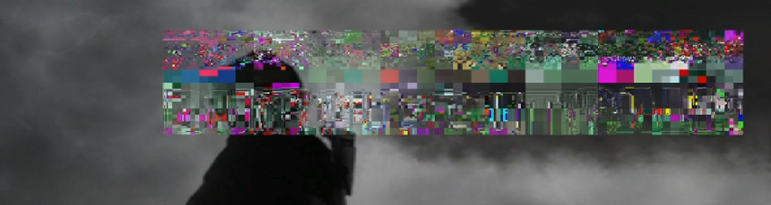

We started building the game with ASAN enabled, and this "just worked" in Visual Studio, it was very helpful.

##### Recruitment Drive

With the majority of the soul-crushing gruntwork done, I felt like we could recruit some homies to help us debug the game.

I'm friends with a good chunk of the [R1Delta](https://github.com/r1delta/r1delta) team, who had just finished their Titanfall 1 Server Mod, so it was good timing.

From R1D:
- [Dogecore](https://github.com/HappyDOGE)
- [Mr Steyk](https://github.com/mrsteyk) (An OG Apex hacker)
- Wanderer (R1D founder and CSGO legend)
- [bt](https://github.com/eepycats) (Steam Client Expert, knows more about Steam than Valve probably)

Also we decided to find some COD experts through mutual friends to answer our questions about the game. None of us were exactly COD-specialists, so it was valuable to have their opinions

From COD community:
- [xoxor4d](https://github.com/xoxor4d) (A COD4 expert who has made RTX versions of nearly every other game as well)
- [xensik](https://github.com/xensik) (A COD expert who has made advanced GSC tools amonst other projects)
- [voron00](https://github.com/voron00) (A COD2 specialist who already decompiled a custom dedicated server for COD2)
- [nta](https://github.com/nta) (An OG COD modder and my old boss =P)

(And some Others... Koutsie?)

##### GSC Scripting

The scripting decompilation was completely broken. This is the game scripting, not the UI scripting. (There's 2).

Avail linked [this COD2 server project](https://github.com/voron00/CoD2rev_Server) made by [voron00](https://github.com/voron00) and after some extensive checks, it was 90% similar to COD4.

We invited him to the project, and used some of his code to replace ours.

It was still somewhat broken however, but Dogecore, Mr. Steyk, and myself were able to get it to work (mainly Dogecore).

There was an IDA Betrayal here... 

MY IDA

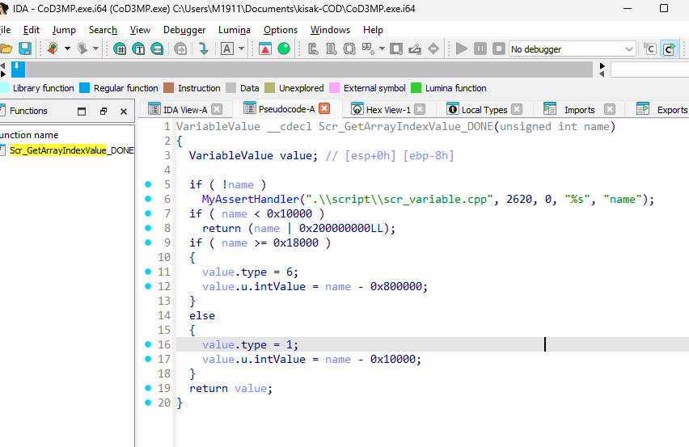

DOGECORE'S IDA

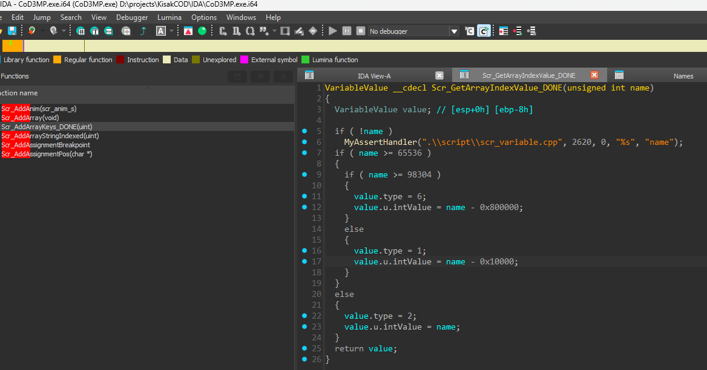

(Note the 0x200000000LL). We're using the same IDA Database and version...

This is supposed to be some kind of epic optimization where it sets value.type = 2 and value.u.intValue = name at the same time, but doesn't work because VariableValue looks like this

```
struct VariableValue
{
    VariableUnion u; // 4 byte union type
    int type;
 }
```

That wasn't the only problem, but one that was interesting...

##### ^6==BOGDANOFF GAMING== 24/7 mp_bog, bots, !skins

For some reason, we chose `mp_bog` as the dedicated testing map. It's honestly a really shit map, sorry. But it definitely has a lot of [nostalgia](https://www.youtube.com/watch?v=a-4KTZlPqok).

Here is the first load into bog(May 30th), at this time, it was impossible to spawn on a team without crashing. (After moving the camera around a bit, the static model cache crashes.)

<video width="900" height="600" controls muted>
  <source src="../videos/firstloadbog.mp4" type="video/mp4">
  Your browser does not support the video tag.
</video>

Also you might notice in this video that some of the xmodels are black. That was a lighting error that took probably a week to find.

Xoxor was able to get further by disabling skinning and the static model cache

<video width="900" height="600" controls muted>
  <source src="../videos/xoxorFirstLoad.mp4" type="video/mp4">
  Your browser does not support the video tag.
</video>

##### Ghost Guns (are based)

After fixing several bugs to get onto a team, there was a lingering non-crashing bug where your gun was floating off of your viewmodel... 

<video width="900" height="600" controls muted>
  <source src="../videos/ghostguns2.mp4" type="video/mp4">
  Your browser does not support the video tag.
</video>

<video width="900" height="600" controls muted>
  <source src="../videos/ghostgun.mp4" type="video/mp4">
  Your browser does not support the video tag.
</video>

Ironically with `r_fullbright`, the models showed up (Ignore the ironsights, that was a another bug fixed later)

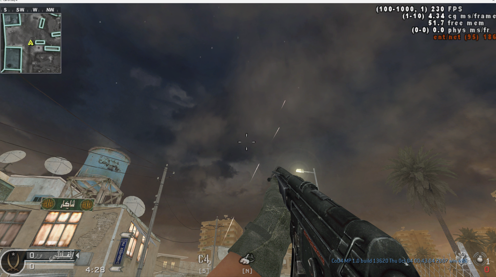

Mr Steyk [fixed it](https://github.com/SwagSoftware/KisakCOD/commit/ce5437b165f2356845de63c24e5967662820ccd2), it was a case of IDA casts being missing.

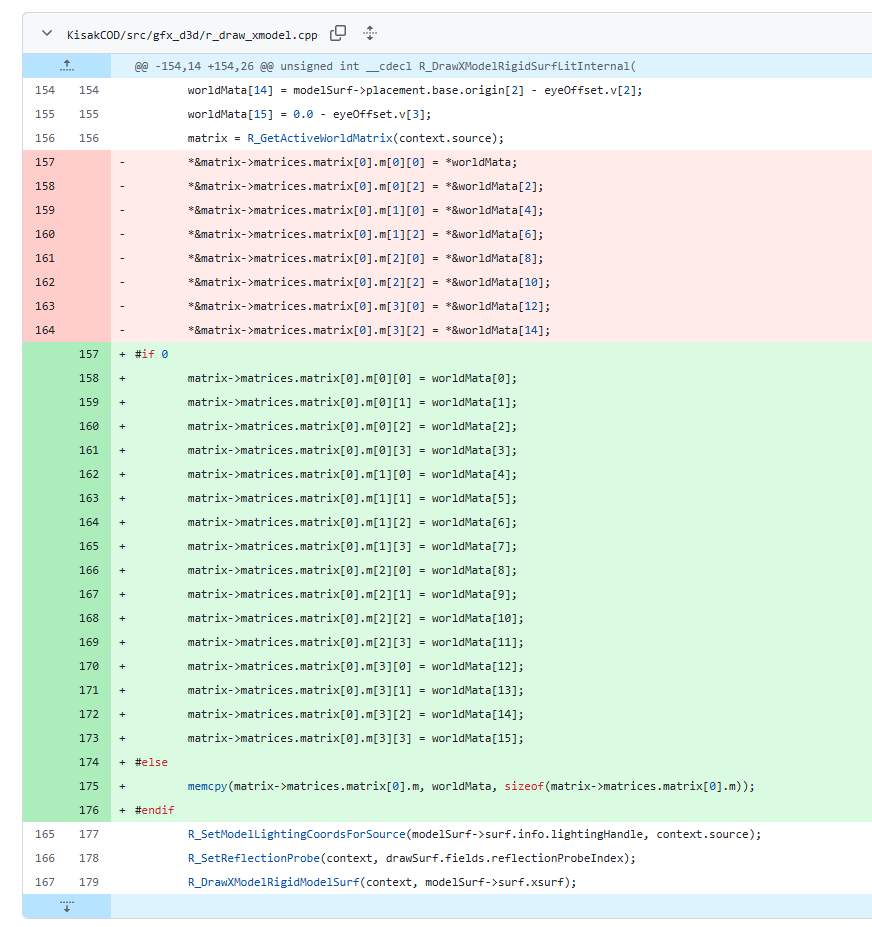

The Ironsights bug was basically a bug [I put in](https://github.com/SwagSoftware/KisakCOD/commit/dd72fb16099ed170fc41d3dd8b76455e0384dbd2) while backporting some Blops1 PDB code. 

The Blops1 PDB has less functions inlined, and it has some nice matrix functions that line up with the XBox COD4 PDB.

##### "Destructive Interface" fixes physics

Physics started off something like: 'the game freezing and Visual Studio forcibly bringing itself to the front.'

Later we fixed it through some meticulous function-matching, although it would send the objects down under things.

Part of that involved a subtle change in ODE's LCP solver:

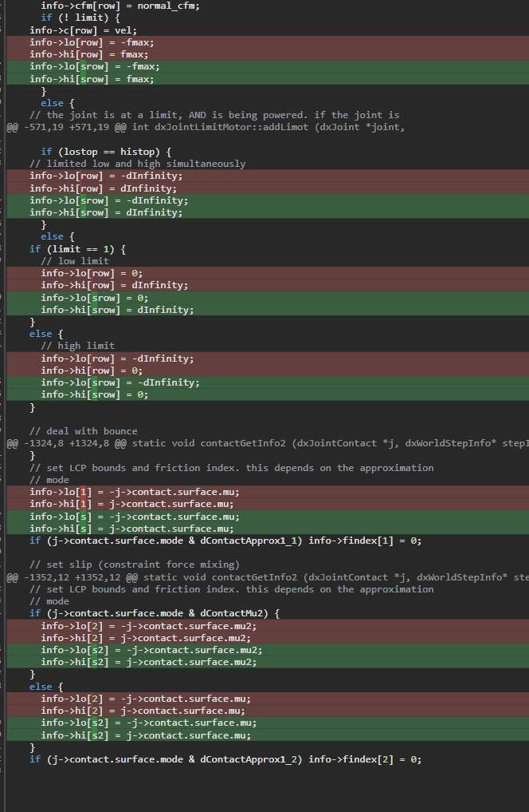

<video width="900" height="600" controls muted>
  <source src="../videos/physicsgrug.mp4" type="video/mp4">
  Your browser does not support the video tag.
</video>

The solver had to be redone, a bunch of allocation stuff changed to use an object pool system, ODE trimesh gutted, remove most vtables, bolted on a bunch of extra collision code (Phys_)

"Destructive Interface" [fixes ragdolls as well](https://github.com/SwagSoftware/KisakCOD/commit/f5b373b1cfa9ca7bd425d24d9b87eb915f311010)

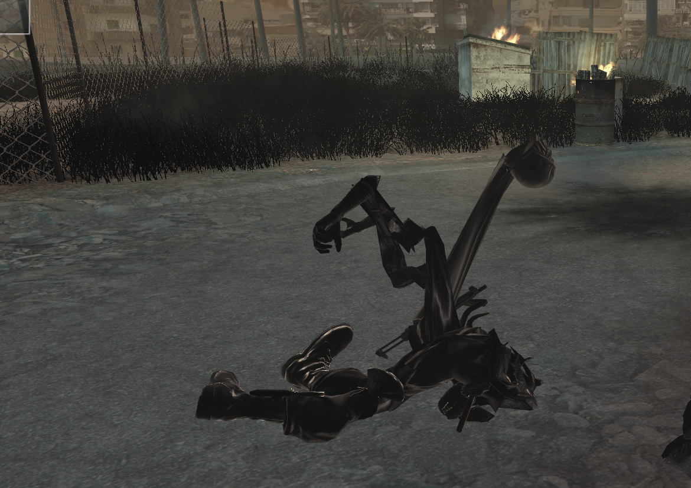

Along with some matrix stuff, I had put an erroneous semicolon (woops)
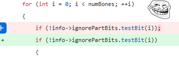

"Destructive Interface" also fixed a nasty bug where a function returning bool was cast to a function returning int

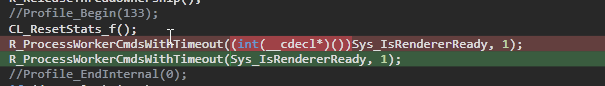

Bool only uses the lower 8bits of EAX, while int uses the whole thing. The function was only zero'ing out the lower 8 bits of EAX when returning false, but the caller was reading the whole EAX.

##### Black lighting

After a long while of trying to find where exactly this black lighting bug was, eventually I changed the behavior with a cleanup commit and found the area by doing partial reverts locally.

Turns out, it was in the lightgrid system. There's thousands of lines to dig through here, but I'll isolate the function and you the reader see if you can tell where the bug is.

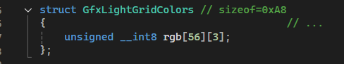
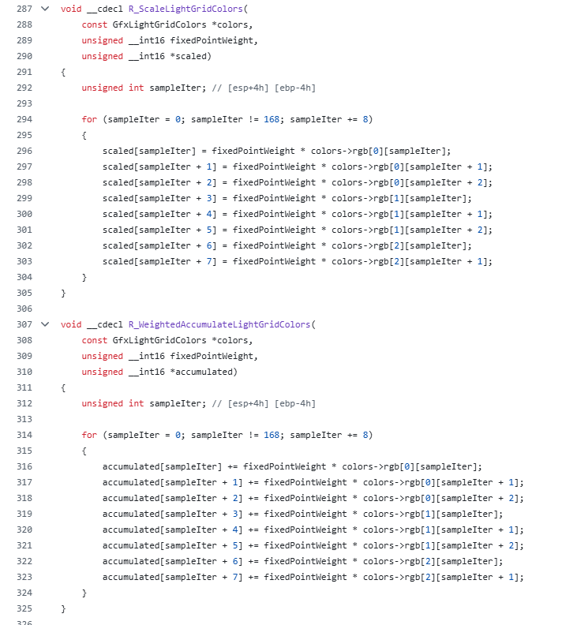

##### Are LightGrids actually fixed??

After "fixing" the lightgrids, I encountered some areas where the viewmodels would turn RGB.

<video width="900" height="600" controls muted>
  <source src="../videos/lightgridRBG.mp4" type="video/mp4">
  Your browser does not support the video tag.
</video>

I tried to yolo-search for some more bugs in this area, but wasn't coming up with anything.

After doing some research, it turns out that this is ***Expected Behavior in Vanilla COD4*** It's actually a dvar called `r_showMissingLightGrid`

More info here: [https://wiki.zeroy.com/index.php?title=Call_of_Duty_4:_Gridfile](https://wiki.zeroy.com/index.php?title=Call_of_Duty_4:_Gridfile)

I couldn't believe it, so I booted up retail COD4 and set the command.
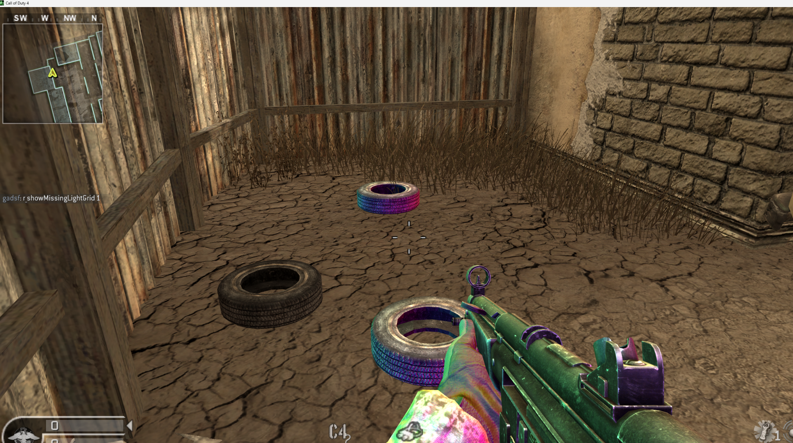

Sure enough it's actually normal and RGB in the exact same spots.

After this the lighting was too bluish, but found that it was just some float convar parsing from the BSP pretty quick.

##### Final Cleanup before first Public Release

Before public release, there were a few things that we did to just tie up any big loose ends.

- Split a "DEDICATED" server build (This is really just `com_dedicated 2`, we were going to try and have a linux dedi but splitting it in half got nasty and was reverted. It'll come later.)
- Add Steam API Auth to replace the CD Key Auth. (This offers server admins a way to ban people, and discourages piracy).
- Misc Cleanup (and the writing of this blog)


##### Not Done yet

There's still a lot of IDA decompiled code that needs to be cleaned up to make the codebase look and run better.

[An Example of one function being cleaned up](https://github.com/SwagSoftware/KisakCOD/commit/cc6db5f7897c7f2b5d2f3a2f968ab4b4ee72df7a)

Asserts need to go into under the `iassert` macro and not be hardcoded, unused variables need to go, `v123` style variables need to go, logic can be simplified, `// [esp+440h] [ebp-25ECh] BYREF`-style stack comments need to go. 

There are also probably quite a few bugs left, waiting to be fixed.

These can be fixed at a fairly chill pace, and then when ready, we can branch and try some more experimental things.

## KisakCOD: Initial Launch State
The state of KisakCOD right now is that the game seems to work as intended except for a few non-gamebreaking things.

Known bugs:
- Team icons shown while spawning sometimes show as a white square
- Stencil shadows don't work
- sv_wwwDownloads are stubbed out due to libWWW being ancient and the boilerplate code being unfindable (should be replaced with CURL)
- Controls seem to get corrupted when switching profiles sometimes

Other than that... nothing comes to mind...

There remain quite a few undesired behaviors, and lots of potential for additions.

## A Real COD4 GPL Release would be Ideal...

{: width="150" }

It'd be nice if Microsoft (Also the owners of GitHub) would just sanction an official GPL release of COD4.

It'd be a good PR move, and as you know, Doom3 doesn't compete with Doom2016+.

Just some food for thought...


## SwagSoftware Marches on

*SwagSoftware* is always looking for our next project.

Do you have something interesting? 

We are currently looking for the following retro game symbols or source:
- Ghost Recon 1
- Farcry Instincts
- Syphon Filter
- COD4 mod tools
- James Bond idtech games
- Need for speed Most Wanted (PC PDB known to exist)
- Need for speed Carbon
- Anything from the 5th-7th Generation of Game Consoles


