Run it back.

**(This Post assumes you've read the [Previous Entry](https://lwss.github.io/Duty-Of-Kisak/))**

## KisakCOD Developments
After the release of KisakCOD, there were several other areas that still needed to be worked on.

The most obvious was SP(Single-Player) support. Most mods use single-player because in COD4 the actor code was not linked into the MP executable - meaning there's no native AI system in Multi-Player.

I started work on SP, using the XBox 360 COD4 PDB+Map file.

First, using the .pdb, I identified files that were exclusive to the SP build and created placeholders for them.

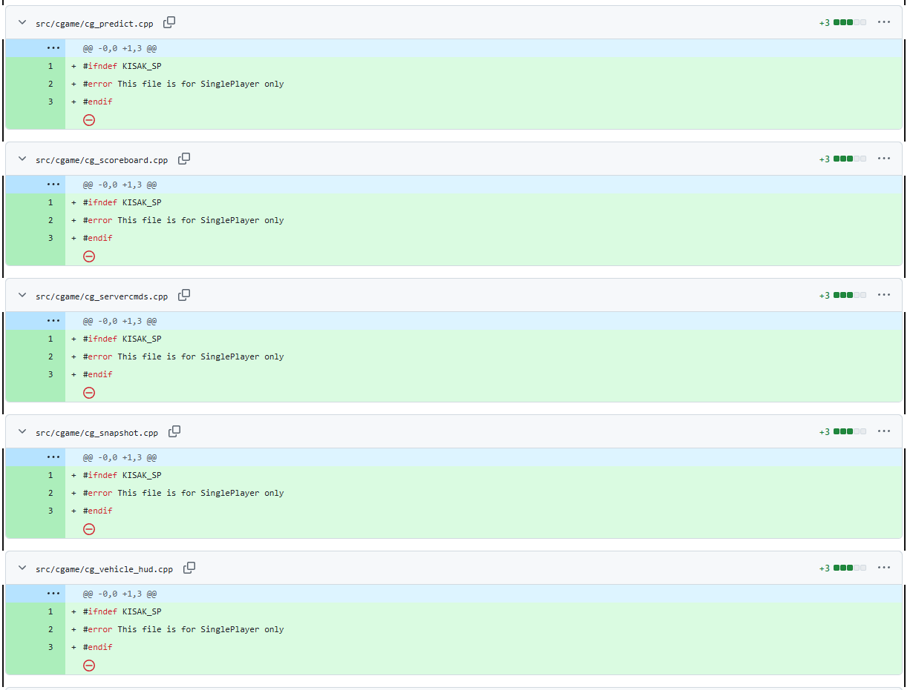

These were mostly in folders that lacked the `_mp` suffix. 

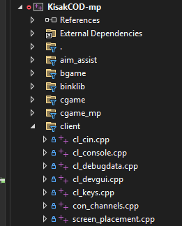
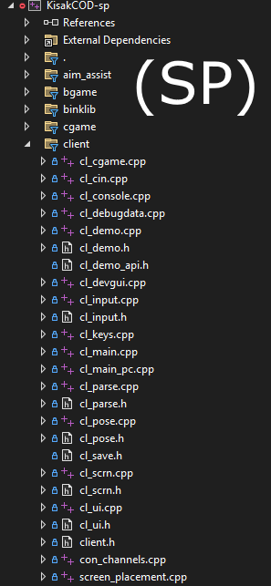
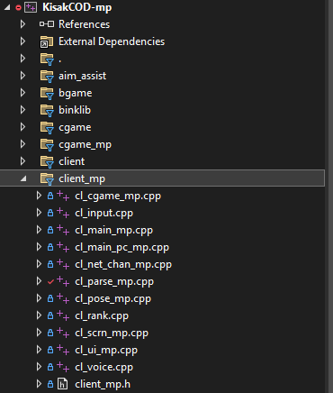

It's probably not perfectly accurate to how it was laid out in the real source, but I don't think that they copied the entire source tree to make MP. (Which is actually what Jedi Academy and others did)

So to simplify the SP work, it was mostly adding `#ifdef's` to the main logic loops, Adding new SP variants of files, and including new files that MP didn't have.

Most of the work was adding the AI ("actor") Code.

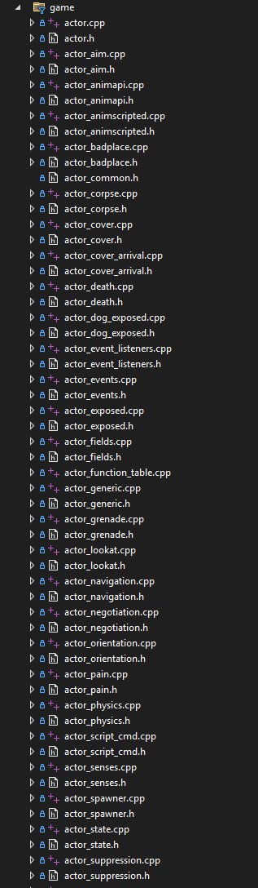

The XBox's PowerPC architecture complicated things

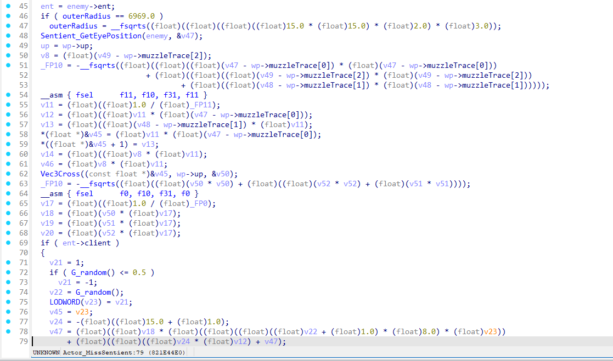

In Later COD's, the Actor code is included in the MP Executable, so if you're careful to monitor it for changes you can use much cleaner x86-based psuedocode.

After a while, the SP was in a "compilable" state, but was extremely buggy.

#### Tangent: Script Debugger

This caused some motivation to go off and fix the Script Debugger. COD4 actually has a built-in version that looks like emacs with Visual Studio-inspired controls.

It's complete with watches, variable listing in scope, breakpoints, and more.

<video width="900" height="600" controls muted>
  <source src="../videos/cod4scriptdebugger.mp4" type="video/mp4">
  Your browser does not support the video tag.
</video>
```
Later COD's would scrap this for some kind of remote script debugger. Probably a pragmatic choice, given that this was designed for 4:3 CRT's and runs in-game. But you gotta admit someone spent a good amount of effort on this and it's pretty cool.
```

#### Tangent: No-FastFiles

Debugging continued, another tangent would be taken to enable the use of "no-FF" (`useFastFile = 0`). Getting this working basically involved fixing all the previously unused `*_load_obj.cpp` files, then preparing some data to load. Luckily IW included the .map radiant file for 1 SP map and 1 MP map, along with a test level. 

<video width="900" height="600" controls muted>
  <source src="../videos/cod4spmenu.mp4" type="video/mp4">
  Your browser does not support the video tag.
</video>

<video width="900" height="600" controls muted>
  <source src="../videos/cod4testmap.mp4" type="video/mp4">
  Your browser does not support the video tag.
</video>

<video width="900" height="600" controls muted>
  <source src="../videos/cod4testmapsp.mp4" type="video/mp4">
  Your browser does not support the video tag.
</video>
```
As you can see it's quite cooked, it's actually in this state as of today - keep reading...
```

#### Tangent: Shadows

Yet another tangent was taken to finally go fix the CSM Shadows that were affecting the MP build as well.

The state that they were in: 

<video width="900" height="600" controls muted>
  <source src="../videos/cod4bustedCSM.mp4" type="video/mp4">
  Your browser does not support the video tag.
</video>

I'm not a gfx programmer, but I'll try to simply explain the Shadow system.

COD4 calls these `Sun Shadows`.
They are separate from things like lamps which are a `Spot Shadow`
They're stencil shadows, they trace from the sun's position onto the geometry of the level and go into a shadowmap(texture).
If you had one giant shadowmap for the entire level, it would need to be an extremely high resolution to look good(the shadowmap has to stretch across from the POV and distance of the sun).
A high resolution map would lag, So instead, there are 2 of them, a near, and a far partition. (Cascading Shadow Map ideology)

The complexity comes from the fact that it has to tie into the PVS(Potential-Visible-Set) system from Quake, it's also multi-threaded and `r_smp_workers` will take turns chewin' on it.

After verifying all of the logic, turned out it was a data problem.

Long story short, the bug was a typo in `R_SetVisData()` that was improperly setting the TLS data.

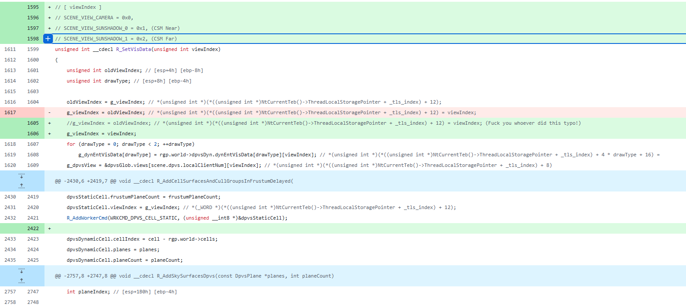

(Working)
<video width="900" height="600" controls muted>
  <source src="../videos/cod4workingCSM_TODAY.mp4" type="video/mp4">
  Your browser does not support the video tag.
</video>


## The Ultimate Tangent
I had found myself using the BLOPS PDB more and more to correct things that I had done sloppily or wrongly in the COD4 SP decomp.

I was noticing a lot of tasteful updates in various areas, and not only for the actor code.

*Eventually, I decided I would just go ahead and decompile the entirety of Black Ops.*

This was mainly so I could just digest and compare the code easier, but I also figured that it would be a good box o' parts to steal tech from if I ever fork and make a super COD-hybrid engine.

Thus, the Black Ops decompilation was started. *It was the beginning of a new and excitingly different story.*

#### Black Ops

Now personally, I like COD4 the best. But don't take that the wrong way; it's like saying *Fellowship of the Ring* is better than *Return of the King*. I actually went to the midnight release of BLOPS, and it was the last COD I ever played. 

One might think that you could just take the COD4 code and 'update' it to BLOPS standard, however in practice that's an awful idea since any small bit of wrong-ness in a struct or function can cause major bugs.

The Black Ops decomp was treated as a whole new game, and everything was started from scratch.

#### Other Decomp Attempts

I'll briefly mention that there have been some attempts in the past to decompile BLOPS, but afaik, none of them got finished.

There's [OpenBO1](https://github.com/AmIKnowYou/OpenBO1) - A hook-based project that forwards unimplemented calls to the official binary that it runs alongside. Seems to have stopped about 4 years ago.

Another one is [OpenT5(rust)](https://github.com/paleauraaaa/OpenT5) - An attempt at not only decompiling BLOPS, but also in the process, re-writing it in Rust. This one didn't get far.

There is one more that's also called "*OpenT5*", this one isn't on Github anymore but was the best attempt. At first glance, it appears very unfinished, but upon closer inspection it actually had a lot of care put into it. Judging from where the code was fixed, and what systems were disabled, I'd guess that they got as far as loading into the menu's and then called it a day. I'll give these guys some kudos because in a few spots, I saw they had cleaned up things that I had not yet, and used their impl as inspiration. In the gfx area especially, they did a good job.

## The Decomp Starts
First, I wanted to try and revise my initial process. KCOD was too manual for this step, and using the .map file was unneeded.

I forked [RawPDB](https://github.com/MolecularMatters/raw_pdb) and created some simple edits to create the sourcetree from the paths in the PDB.

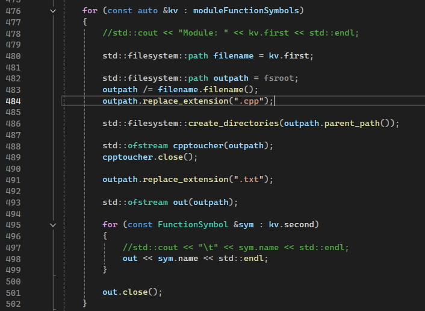

I created a blank .cpp file, and a .txt file containing which functions were supposedly in that .cpp file.

After this, I had an IDA script parse every .txt file, fill the .cpp file, and create an associated header for that .cpp file.

```
This is a bit inaccurate here, since in COD they don't always have a .h for each .cpp. There are times where they use header_local.h and header_public.h for an entire folder. Like most things, it can be fixed later if wanted.
```
<video width="900" height="600" controls muted>
  <source src="../videos/idadecompingblops.mp4" type="video/mp4">
  Your browser does not support the video tag.
</video>

My IDA Script also tried to hackily fix a few known bad patterns, just using a simple text find/replace while running.

There's still a lot of room for improvement here in the generation stage.

I decided to do things in more passes this time, 

For the whole codebase, it was something like:
- The first pass I would just go into the headers and add types
- After that I would go fix intellisense errors in each .cpp
- Then go try to compile each cpp with ctrl-f7
- A final link error fixing pass

The idea was that I could do partial re-generations on un-touched files after doing some fixes, but honestly it seemed like it took way longer.

This also could have been because BLOPS was much more arduous to decompile.


## The Unique Challenges of BLOPS
BLOPS has a lot of things that COD4 does not, I'll try to list them...

#### Mixed Int-Float load/store.

the BLOPS compiler has some kind of optimization where floats will sometimes treated as int's and stored in 32bit registers, it looks like this:

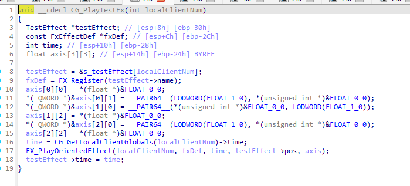

Float constants are usually treated as DWORD's

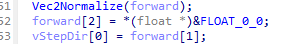

Whenever a negation or fabs() is used, it will instead treat the float as an Int and use a XOR operation on it.

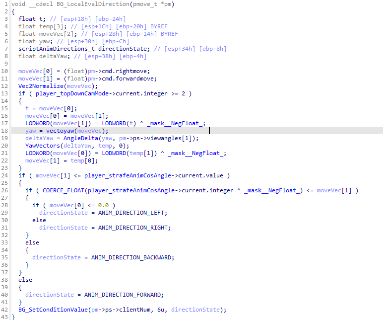

Of course a lot of these can be automatically search+removed, but you still have to deal with them when manually re-working a function or when the search+remove didn't catch it.

#### Stack mis-alignment
Because some classes have specified 16 alignment, and are allocated on the stack, the frame for some functions is broken.

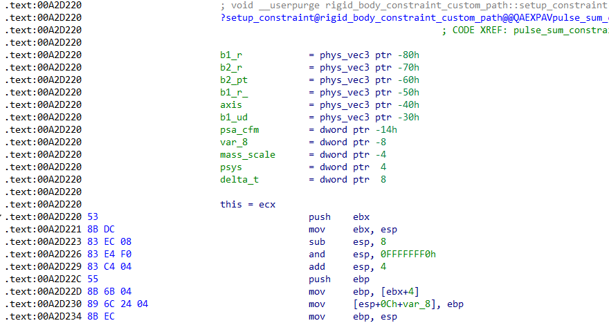

Usually the stack is off by 12, the fastest way to fix this is to just go into Stack-View and delete 12-bytes worth at the top. (Make sure you add more to the bottom if you run out of arg-space)

Hex-rays and the disassembly aren't really "in-sync", hex-rays takes it as a hint, so this works. You just need to remove some junkcode at the start that exists because of the alignment.

#### More C++ Polymorphism
While COD4 was mostly C, with some C++ flavorings, Treyarch prefers to write C++ and a lot of their code has fairly complex virtual Inheritance where slight mistakes can lead to bugs.

See [https://github.com/SwagSoftware/KisakBlack/commit/eac4762c4ebcb686e0a15fb8d596efea48fefba2](https://github.com/SwagSoftware/KisakBlack/commit/eac4762c4ebcb686e0a15fb8d596efea48fefba2) for a real example.

Even when carefully following the vftables, I still made a few mistakes that had to be fixed later.

#### Much Bigger amount of Code
BLOPS has a lot more tech than COD4. Not only did it come out 3 years later, they also got to take whatever they wanted from MW2 after it shipped in 2009. Since I'm going from COD4 -> BLOPS, I don't know exactly when what was added, or who made what, but I'll try to list some extra tech that BLOPS has.

- DemonWare (This is what we in the business today would call a "Game Coordinator")
- Moving foilage/objects
- Wind
- Glass System (MW2)
- Flame System
- New Treyarch custom Physics engine (from Spider-Man)
- New XAudio engine with more effects
- Vehicles
- IK System
- Major changes to Scripting, now runs in instances, client=60hz, server=20hz.
- Major changes to threading and graphics, tl job system.
- A Treyarch Backdoor called "monkey" that phones home to the "zookeeper"
- nvapi (currently disabled in kblack, but was used for nvidia vendor-specific d3d9 intz extension)
- DynEntity server support
- Lots of `live` integration (Connects to DemonWare - think Online, friends list, progression, matchmaking, etc)
- DDL (Data Def Language, serialization for the player stats, match stats, profile data, etc)

Among many changes to many other systems. Again, we're talking about 3 years of full Development since COD4 during the peak-era of gaming altogether, by some of the best AAA developers at that time.


#### DemonWare.
While Decompiling BLOPS, I also had to simultaneously remove DemonWare. Initially, I was decompiling DemonWare as just part of the game, but quickly got fed-up with how pointless it was.

It's not a good library. My Steam copy of Black Ops does not work. I had to get Plutonium just to launch an offline map during my testing. 

Interesting enough, there is a [2011 presentation from a DemonWare developer](https://www.erlang-factory.com/upload/presentations/395/ErlangandFirst-PersonShooters.pdf) talking about his work on BLOPS and other games.

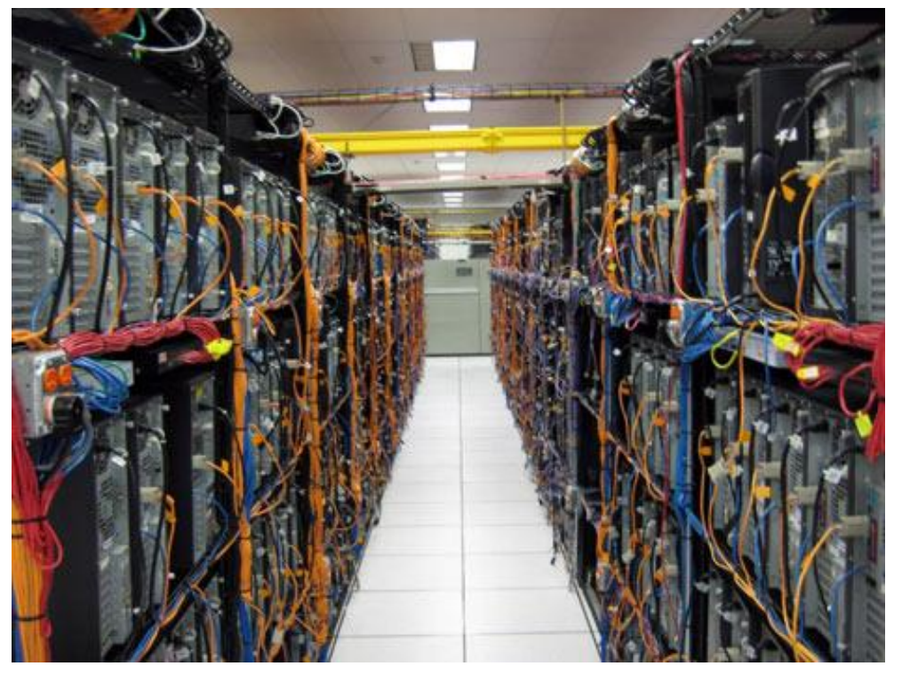
```
This is a real photo of the Black Ops servers. (Desktops!)
```

In the presentation, he basically laments how all their C++ code kept crashing, and how the switch to *Erlang* (Some niche VM language) was truly epic for them.

This library is just something that was tacked onto the game to give it online features similar to Halo. I don't really consider it part of the game, although it did do its job back in the day.

Since the types are pretty deeply-baked into Black Ops, the WIP `/DemonWare` folder remains for now, but it's basically unused.


#### Treyarch Library (TL)
Treyarch decided to make the engine "their own" (*I respect that*) and put in their own in-house code. The biggest headache by far was the Physics system, but also the Jobs system is a bit of a mess.

## Debugging Starts

After a grueling decompile, it was time to start debugging and fixes. 

Since this Decompilation is technically based on a Server executable of Black Ops, the first task was to turn it back into a Client. In this Era of COD games, the Dedicated server was basically just the MP binary with a dvar `dedicated` set. The Graphics code and everything is still there because the server needs to load the same level files that the client needs to, I'm guessing it would have been needlessly messy to cut all that out for the dedicated server.

In parts where there are dedicated-specific branches, the client code was actually not optimized out by the compiler, it was just forcibly branched off via a 1 in the ASM.

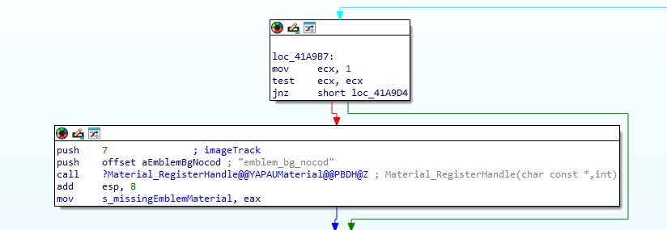

Hex-rays won't show these until you byte-patch it to 0, you can sig some of them, others are found through trial and error.

results for: `b9 01 00 00 00 85 c9 75` (74) would be another good jmp

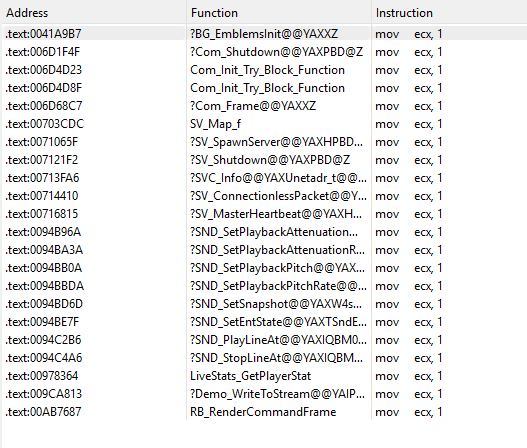

After getting the database fixed, it was loading to about here:

<video width="900" height="600" controls muted>
  <source src="../videos/blackopsliteral.mp4" type="video/mp4">
  Your browser does not support the video tag.
</video>
```
really looks like BLACK ops
```

After some more bug fixes, the menu was working and I could start getting to the actual meat and potatoes of getting the game to load.

<video width="900" height="600" controls muted>
  <source src="../videos/menuworkingnetfubar.mp4" type="video/mp4">
  Your browser does not support the video tag.
</video>

After removing some more evil-satanic-blasphemous Demonware checks (waiting for stats from a master server), turns out there was a [bug](https://github.com/SwagSoftware/KisakBlack/commit/7bf2921b001dfda3ba8f9ad3e6ac3402468bb53e) next to my `svCompressedBuf` - used in `SV_SendMessageToClient()`.

Now we're at the part where it's negotiating the ClientState between the client/server. (a.k.a. SignonStates. Used to choke these in Dota and do all sorts of nasty stuff).

I had chosen `mp_mountain` as the testing map this time around, it's one of my favorites, and `mp_bog` wasn't in BLOPS for some reason.

`mp_mountain` actually has a lot of glass, and even glass that breaks upon server start, this forced me to go immediately fix the networked glass Snapshot code.

Since this Decomp is based off of BLOPS v1.0, several scripting built-in's needed to be added in order for the level's script files to load. This was done by reversing the retail MP game. Most of these are untested, and uncalled so far. 

After that, it was time for the Physics engine. The Physics engine was a huge slog, just getting it to even load in-game took probably 2 weeks of refactoring.

Here's a vid from about that point


<video width="900" height="600" controls muted>
  <source src="../videos/physicswhace.mp4" type="video/mp4">
  Your browser does not support the video tag.
</video>
```
We still have no idea what a "whace" is, anybody know? It's used similarly to an AABB.
```

Fixing the audio required a slight XAudio Inheritance change regarding `CXAPOBase` [see here](https://github.com/SwagSoftware/KisakBlack/commit/69402e3a7a7aa203ab4cc3968dde14675a4ceab3)

After some more bug fixing, it was possible to load in-game, although it was extremely fubar'd. 

<video width="900" height="600" controls muted>
  <source src="../videos/whiteops.mp4" type="video/mp4">
  Your browser does not support the video tag.
</video>
```
Call of Duty: White Ops
```

There was a pure white screen, running at 5fps. 

I implemented Tracy into the PIX stubs (along with some new ones), it was Dx9 Present taking forever. Time for graphics debugging tools.

I was extremely tired of using apitrace(*a.k.a. vogl!*), it's slow and has to simulate every call from the start. I had started using it on Linux for KSGO when hooking up the UI.

For 32bit dx9, there's not many options. I decided to try the Intel Graphics Monitor, but found that it crashed whenever you attempted to capture a frame. (Seems like a widespread phenomena)

So I went to PIX, I had tried this once before from someone running into a KCOD issue, but had some weird errors while using it then, while apitrace ran fine.


<video width="900" height="600" controls muted>
  <source src="../videos/blopsPIX.mp4" type="video/mp4">
  Your browser does not support the video tag.
</video>
```
PIX UI is a bit annoying to use when there's an error, but it's a good tool overall; the best for Dx9. It's even clone-correct, it's what the Developers of Black Ops were using.
```

So off the bat, PIX was error'ing due to some call of CreateQuery() with invalid parameters, it was hard to get more info out of it than that. BLOPS does call CreateQuery in a few places, but not where it was crashing.

Eventually I loaded d3d9 into IDA, got the name of CreateQuery, loaded d3d9 symbols while debugging in MSVC and set a breakpoint on the actual CreateQuery callee function.

Turns out, it was something inside the `nvapi` library that was added for a small vendor-specific Nvidia intZ extension. (This could have easily been skipped over during the decompilation process, but it was added for authenticity, not only that but the nvapi library itself wasn't easy to find, thx to dogecore for that)

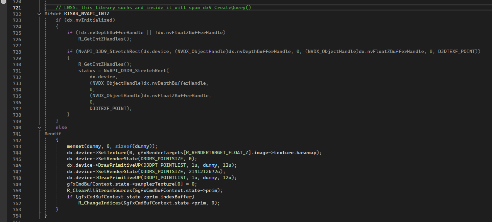


After removing this library, and some [shader fixes](https://github.com/SwagSoftware/KisakBlack/commit/ba3e02b3167f8ff0140e8156053bf79e1bb0afcf), the Graphics worked OK.

<video width="900" height="600" controls muted>
  <source src="../videos/loadinfirst.mp4" type="video/mp4">
  Your browser does not support the video tag.
</video>

Lots of things were still broken, most notably was the fact that you couldn't move due to the physics still being broken.

<video width="900" height="600" controls muted>
  <source src="../videos/loadinfirstalt.mp4" type="video/mp4">
  Your browser does not support the video tag.
</video>
```
Stuck in place due to physics
```

So it was time for more physics debugging.

This time, I went out of my way to edjumacate meself on the nuances of GJK. Turns out the [U.S. Army has an official handbook on the in's and out's of GJK](https://apps.dtic.mil/sti/pdfs/ADA622925.pdf)

I'll share the basics with you -

The Treyarch Physics engine has these types of Collision Geometry

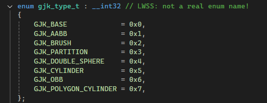

Each one of these is Convex, and the player collision is a `GJK_POLYGON_CYLINDER` with 12 faces (6 front, 6 back). These shapes are all classes that implement an interface, `phys_gjk_geom`.

GJK Calculates if 2 shapes are colliding. This is done in `phys_gjk.cpp` mostly in `phys_gjk_info::collide()`

There are 2 variants, `phys_gjk_info::gjk_ray_cast()` and `phys_gjk_info::gjk()`, the ray_cast version does Continuous-Collision, that basically just means that instead of just figuring out if 2 shapes collide, it figures out when they collide (0.0 ->1.0 in terms of frame). (iirc. I tried disabling it and going up stairs was hard.)

After calling one of those functions, you'll see that the `collide()` function does a loop at the bottom, this is the pushout code that calculates how far the shapes are colliding into each other, and how to separate them.

After mucking around in here with some rudimentary knowledge, I was able to sorta fix it partially.

<video width="900" height="600" controls muted>
  <source src="../videos/shotgunphysics2.mp4" type="video/mp4">
  Your browser does not support the video tag.
</video>

You can somewhat move now, but the collision is horrible.

I checked other areas of the physics to make sure they worked OK, I wasn't entirely sure the problem was here in the GJK still.

<video width="900" height="600" controls muted>
  <source src="../videos/broadphase.mp4" type="video/mp4">
  Your browser does not support the video tag.
</video>
```
This test might look dumb, but it's verifying that the broad phase stage is feeding the right pairs into the collision - which it was. 
```

#### AI Debugging
I decided to succumb and get an AI to come look at this problem and see what I was doing wrong.

Historically, I've been somewhat anti-AI, but I have used it a bit in the browser to answer some questions or cleanup easy tidbits of a function that I didn't want to. 
Usually I try to label things as `aislop` if they were edited by AI, I consider it as non-perfect work. 
Say what you want about hex-rays slop, at least it's generated by a deterministic algorithm.

However, it seems that about half of my friends are now AI experts, and I was still AI-illiterate. 

I got Claude Max, Claude Code, and set up the [IDA MCP](https://github.com/mrexodia/ida-pro-mcp) with Opus 4.7 1M (later 4.6).

After about a day and a half of tinkering, I got it to figure out what the problem was, which of course was minor math errors in the GJK.

<video width="900" height="600" controls muted>
  <source src="../videos/collworking.mp4" type="video/mp4">
  Your browser does not support the video tag.
</video>
```
Collision working, but you can see many other things are still busted.
```

At first, I told the AI to do 1 function at a time and check the logic vs. IDA(ASM). Then, 1 file at a time, but eventually just gave it tasks, and an idea of which files/functions to start in.

Regarding typo's and minor errors, it was extremely fast and effective at finding them (in off-peak hours).

With more complex tasks, it required some coaching, but could work through them slowly depending on what the issue was.

With the AI, I figured I could save a ton of debugging time, so that's exactly what I did. 

In-between coaching the AI, I could continue to work on something else in parallel. While the AI was digging through files, looking for bugs to report back to me, I was jumping off a cliff or blowing myself up and fixing more bugs in different areas.

I don't have a lot of footage for this, things were moving more quickly, but here's an amusing bug that happened because I typo'd an fabs().

<video width="900" height="600" controls muted>
  <source src="../videos/axelinrussia.mp4" type="video/mp4">
  Your browser does not support the video tag.
</video>
```
(This tip-toe animation is supposed to only play at very steep inlines)
```


Another interesting bug happened after setting up the dedicated server.

<video width="900" height="600" controls muted>
  <source src="../videos/dedibug2.mp4" type="video/mp4">
  Your browser does not support the video tag.
</video>

This one had a pretty simple solution.

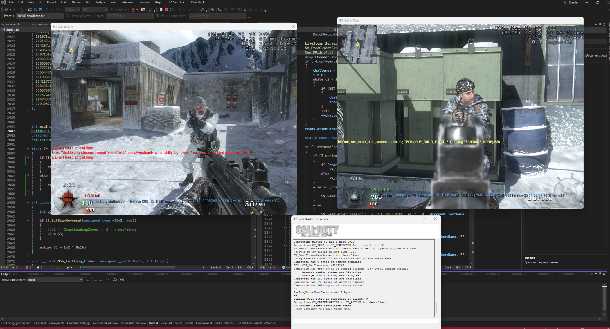
```
Now it works, map center used for position offsets was wrong.
```
---

You're basically caught up, that was a somewhat brief summary of the events leading up to now.

## Conclusion

Anyway, I'm making the repo public now. Maybe you'll find it useful or entertaining. It's not perfect, but always could be improved further if there's interest.

I'm including an extra segment at the bottom, for those who might be interested.

(Remember to send in your rare source code and symbols for old gamez)


<br><br><br>
<br><br><br>
<br><br><br>
<br><br><br>
<br><br><br>
<br><br><br>
<br><br><br>
<br><br><br>
<br><br><br>
<br><br><br>
<br><br><br>
<br><br><br>
<br><br><br>
<br><br><br>
<br><br><br>
<br><br><br>
<br><br><br>
<br><br><br>
<br><br><br>
<br><br><br>
<br><br><br>


## (Extra) A Treyarch Engine History Lesson : from a complete Outsider
*(Written without contact from any current or ex-Treyarch affiliates. I think I have the power to be their friend, but haven't tried)*

First, I would to clear up some information around the "NGL" engine.

If you search up information about Treyarch games, you'll quickly learn about the "NGL" engine.

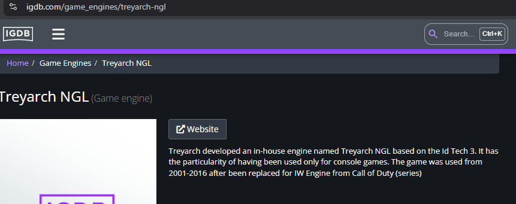

[Youtube Video](https://www.youtube.com/watch?v=QPFnZYsI2yc)


The "NGL" engine is actually publicly available on GitHub via [Kelly Slater](https://github.com/historicalsource/kelly-slaters-pro-surfer/)

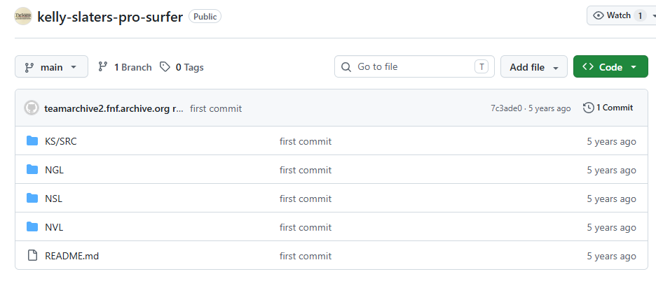

Now if we go into the `NGL` folder...

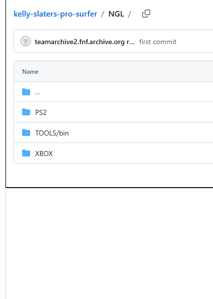

You'll see that it's just the platform-specific Graphics code. Same goes for NVL(N... Video Library) and NSL(N... Sound Library).

If you look through the code, you'll find many functions and types with `ngl` in them, however they're all related to graphics in some way.

Look Here:

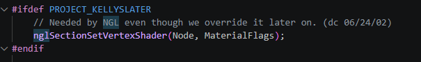

If `NGL` was the name of their engine, it wouldn't be referenced in the comment like this. Imagine the word NGL replaced with `idtech` or `unreal`, while being in those respective codebases. Makes no sense.

Therefore `NGL` must be a bogus name...

With some searching I finally found the real name of the engine.

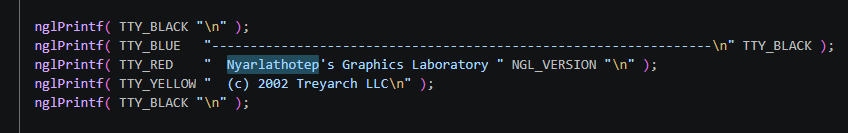

As you can see, the engine is called **Nyarlathotep**. This is an [H.P. Lovecraft reference](https://lovecraft.fandom.com/wiki/Nyarlathotep)

Although the "Graphics Laboratory" part kind of implies it really is NGL, since the developers use "N" to abbreviate "NVL/NSL", and I refuse to go with the fact that the N in those contexts stood for NGL, I'm officially declaring it the Nyarlathotep engine. 

Now with that out of the way, let's move onto the claims that this is an idtech3 engine.

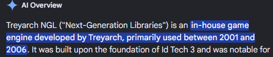

Give the Kelly repo one look and you can tell it's obviously not based on idtech3 at all, it's not even in C. 

HOWEVER, when looking at COD3's (PS3) .map file I can tell it IS based on idtech3.

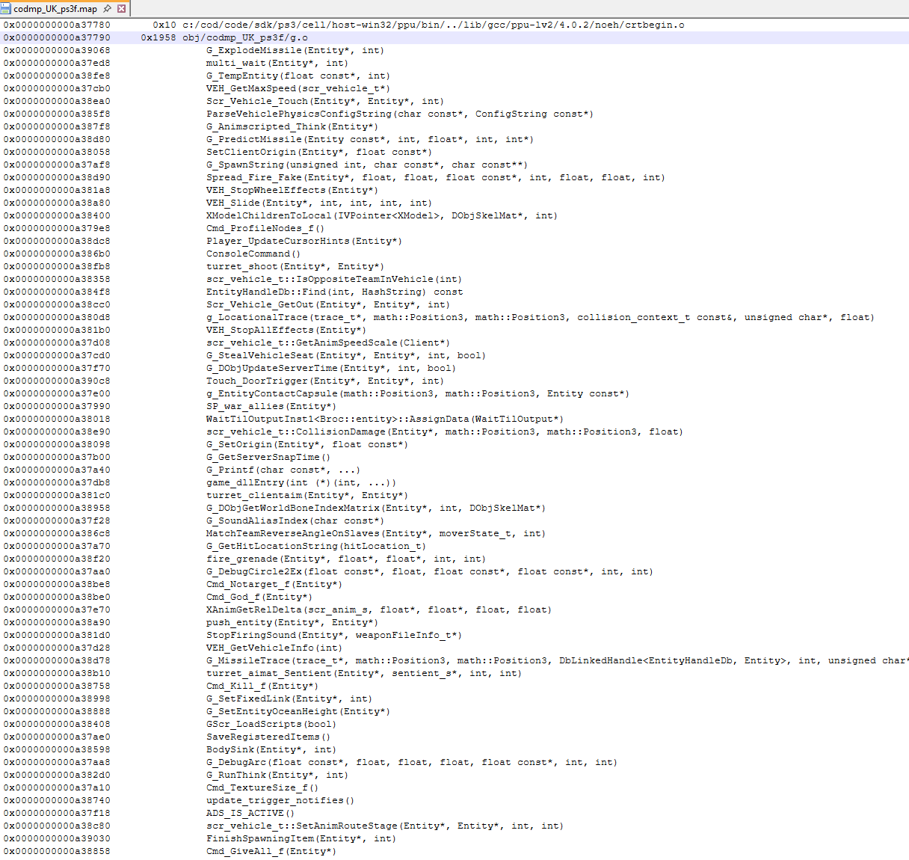

Given some more research, I'm hypothesizing this:

- In 2004, a new branch within Treyarch is given The *Call of Duty: United Offensive* source code. (COD:UO was made by Gray Matter Studios, under Activision)
- This new branch, Treyarch(COD), is focused on COD development. They release *Call of Duty 2: Big Red One* in 2005 (7 days after IW released COD2) 
- At the same time, Treyarch(OG) is making other games like Ultimate Spider-Man(2005) and Spider-Man 3(2007). 
- IW's COD4 was meant to be COD3, but IW took too long, so Treyarch(COD) stole the "3" numeral and released it in 2006.
- COD4 releases in 2007, it's a mega-hit. Treyarch(COD) decides to use their engine and begins work on World at War.
- Treyarch(OG) releases Spider-Man 3 in 2007, and begins work on Quantum of Solace using a hybrid of their tech and COD4.
- WAW and QOS both come out in 2008.
- Both teams combine and begin work on Black Ops.


Treyarch(OG) = Nyarlathotep engine.

Treyarch(COD) = Treyarch COD engine - derived from COD:UO - later derived from iw3.

I think that's fairly accurate, but there definitely had to be some blurred lines at different points in time, for example after COD3.

Towards the end of the BLOPS Decomp, the [Spider-Man 3 source code](https://archive.org/details/spiderman3-code) was found uploaded in a GCC post-processed state onto the PS3 devnet. It was named `broken.ii`, seems like someone was debugging something and decided to upload a big chunk of code.

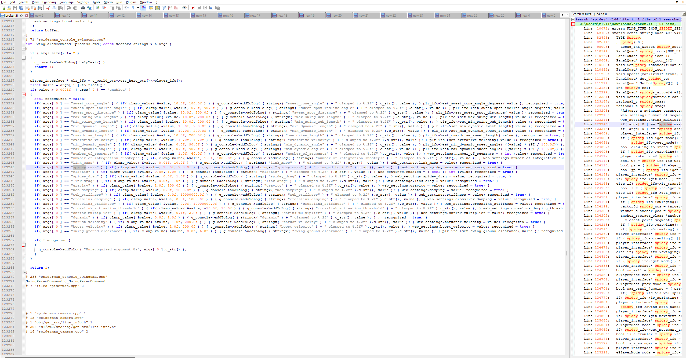

It's all baked and post-processed into 1 file, and has no comments, but it is the real (incomplete) code for the game, pretty cool.

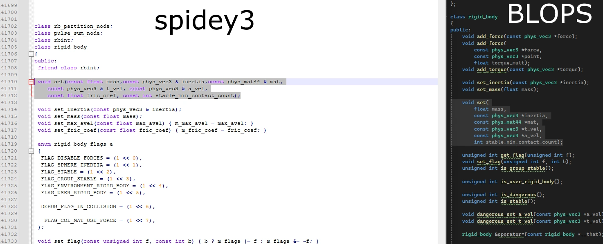

When `phys_player_collision_mode = 1 (DEFAULT)`, BLOPS uses the same spider-man physics code to handle all the collision (with some updates and modifications of course).

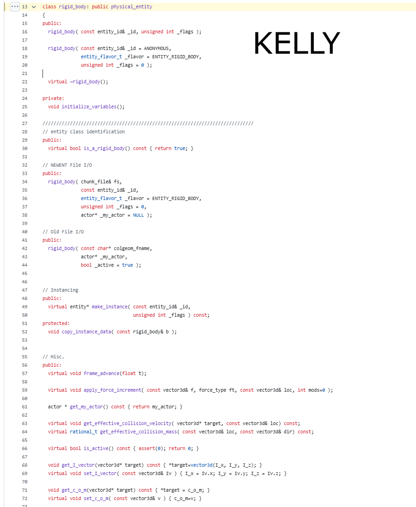

Kelly is quite a bit different here, but you can see some of the same ideas in play.

